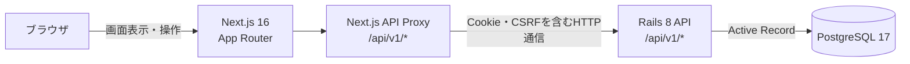
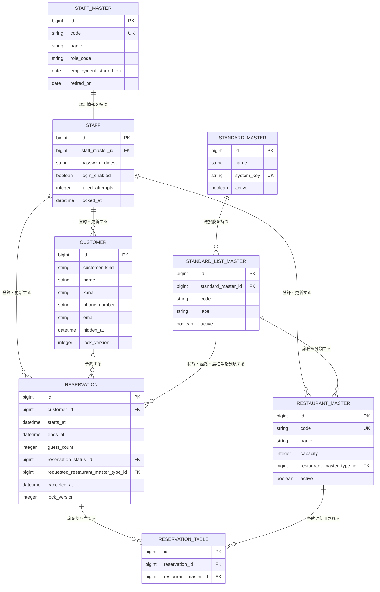

# COLETTE

[](https://github.com/koukikubo/colette-app/actions/workflows/ci.yml)

飲食店向けの予約・顧客管理システムです。

紙の予約帳で起こりやすい情報共有の難しさや、予約情報と顧客情報が分散する問題を改善し、少人数の店舗でも扱いやすい業務システムを目指しています。

## 目次

- [開発背景](#開発背景)
- [デモ](#デモ)
- [主な機能](#主な機能)
- [技術スタック](#技術スタック)
- [システム構成](#システム構成)
- [ER図](#er図)
- [セットアップ](#セットアップ)
- [テスト](#テスト)
- [CI](#ci)
- [今後の予定](#今後の予定)

## 開発背景

飲食店では、電話予約、手書きの予約帳、スタッフ間の口頭共有など、日々の予約管理に多くの運用負荷があります。

紙を中心とした運用には、次のような課題があります。

- 水濡れや紛失による情報消失
- 複数スタッフ間での予約状況の共有
- 予約変更やキャンセル状況の把握
- 予約情報と顧客情報の分散
- 常連顧客への対応品質の属人化

COLETTEでは、予約、顧客、席、担当者、店舗内の選択肢を一つのシステムで管理し、予約受付から来店準備までの情報を共有できる状態を目指しています。

## デモ

デモGIFは、機能ごとに短く分けて掲載する予定です。

| 業務フロー     | 内容                                 | GIF    |
| :------------- | :----------------------------------- | :----- |
| ログイン       | 担当者の選択とログイン               | 準備中 |
| 予約管理       | 日付選択、予約一覧、席別タイムライン | 準備中 |
| 予約登録・編集 | 顧客検索、予約情報入力、席割り当て   | 準備中 |
| 顧客管理       | 顧客検索、登録、編集、詳細表示       | 準備中 |
| マスタ管理     | 担当者、予約席、基本コードの管理     | 準備中 |

GIF作成後は、次のファイルへ差し替えます。

```text
Docs/images/
├── login-demo.gif
├── reservation-list-demo.gif
├── reservation-form-demo.gif
├── customer-management-demo.gif
└── master-management-demo.gif
```

## 主な機能

### 認証・担当者管理

- 店舗担当者を選択してログイン
- ログイン可否の管理
- ログイン失敗回数のリセット
- 担当者の登録、編集、退職、復職

### 予約管理

- 日付ごとの予約一覧
- 席ごとのタイムライン表示
- 予約の登録、詳細表示、編集
- 顧客検索と予約への紐付け
- 複数席の割り当て
- 指定時間に利用できない席の判定
- 同一顧客の予約時間重複チェック
- 楽観ロックによる同時更新の検知
- 予約のキャンセル、復元に対応するAPI

### 顧客管理

- 個人顧客、法人顧客の登録と編集
- 氏名、フリガナ、電話番号による検索
- 顧客詳細の表示
- 顧客の表示、非表示管理
- 楽観ロックによる同時更新の検知

### 店舗マスタ管理

- カウンター席、テーブル席などの予約席管理
- 席数、定員、表示順、有効状態の管理
- 基本コードと選択肢コードの管理
- 予約状態、予約経路、席種、メニュー種別、利用目的などの選択肢管理

## 技術スタック

| 分類                 | 技術                                                     |
| :------------------- | :------------------------------------------------------- |
| フロントエンド       | Next.js 16 / React 19 / TypeScript                       |
| UI                   | Tailwind CSS 4 / shadcn/ui / Radix UI                    |
| バックエンド         | Ruby 3.4 / Ruby on Rails 8 API                           |
| データベース         | PostgreSQL 17                                            |
| 認証                 | Rails `has_secure_password` / Cookie Session             |
| フロントエンドテスト | Vitest / React Testing Library / jsdom                   |
| バックエンドテスト   | RSpec / FactoryBot                                       |
| 静的解析             | TypeScript / ESLint / RuboCop / Brakeman / Bundler Audit |
| 開発環境             | Docker / Docker Compose                                  |
| CI                   | GitHub Actions                                           |

## システム構成



フロントエンドはRails APIへ直接アクセスせず、Next.jsのRoute HandlerをAPI Proxyとして利用します。更新系リクエストではCSRFトークンを付与し、ログイン状態はCookie Sessionで管理します。

## ER図

現行の `backend/db/schema.rb` をもとにした主要テーブルの関係です。



予約と席は `reservation_tables` を介した多対多です。予約状態、予約経路、希望席種、メニュー種別、利用目的は、`standard_list_masters` を参照します。

## セットアップ

### 前提条件

- Git
- Docker Desktop
- Docker Compose

### 起動

```bash
git clone https://github.com/koukikubo/colette-app.git
cd colette-app
docker compose up -d
```

初回起動時は、依存パッケージのインストールとデータベースの準備が自動実行されます。

| サービス       | URL・接続先           |
| :------------- | :-------------------- |
| フロントエンド | http://localhost:3010 |
| Rails API      | http://localhost:3011 |
| PostgreSQL     | `localhost:5434`      |

### 初期データ

開発用データを投入する場合は次を実行します。

```bash
docker compose exec backend bin/rails db:seed
```

初期担当者は「店主」「登録担当」「照会担当」です。開発環境の初期パスワードは `password` です。`SEED_STAFF_PASSWORD` を指定した場合は、その値が使用されます。

### 停止

```bash
docker compose down
```

## テスト

### テスト方針

フロントエンドではVitestとReact Testing Libraryを使用し、実装内部ではなく、利用者が確認できる表示と操作を中心に検証します。

- Componentテスト: フォーム入力、検索、ダイアログ、画面遷移、エラー表示
- Hookテスト: API取得状態、成功、失敗、入力変更時の再取得
- Utilityテスト: 入力値の変換、バリデーション、表示用データの生成
- API通信: テスト単位ではモックし、フロントエンドの振る舞いを独立して検証
- E2Eテスト: ブラウザ、Next.js、Rails、PostgreSQLを通した主要業務フローを将来追加予定

正常系だけでなく、APIエラー、バリデーションエラー、予約重複、楽観ロック競合、二重送信防止などの異常系も対象にしています。

### フロントエンドテスト

全件実行：

```bash
docker compose exec frontend npm run test:run
```

特定ファイルだけを実行：

```bash
docker compose exec frontend \
  npx vitest run features/customers/__tests__/CustomerListPageClient.test.tsx \
  --reporter=verbose
```

ウォッチモード：

```bash
docker compose exec frontend npm test
```

### バックエンドテスト

```bash
docker compose exec backend bundle exec rspec
```

### その他の品質チェック

```bash
docker compose exec frontend npm run typecheck
docker compose exec frontend npm run lint
docker compose exec frontend npm run build
```

リポジトリ全体のフォーマット確認：

```bash
npm ci
npm run format:check
```

## CI

GitHub ActionsはPull Requestとmainブランチへのpushで実行されます。

- Rails: RSpec / RuboCop / Brakeman / Bundler Audit
- Next.js: TypeScript / ESLint / Vitest / Production Build
- Repository: Prettier

テスト名には対象画面と期待する操作結果を記載し、CI失敗時に問題のある業務操作を特定できるようにしています。

## 今後の予定

- 顧客詳細への予約履歴・利用状況表示
- 予約実績をもとにした顧客ランク算出
- 認証用パスワードリセット機能の実装 -　お知らせ機能の実装
- 予約後の振り返り機能
- 全体的なUIの調整
- 共通エラー画面と404表示の整備
- 主要業務フローのE2Eテスト
- デモGIFと画面キャプチャの追加
- 本番環境へのデプロイ手順整備

## ドキュメント

- 画面設計・ADR: [`Docs/screen/adr`](Docs/screen/adr)
- 学習メモ: [`Docs/screen/learning`](Docs/screen/learning)
